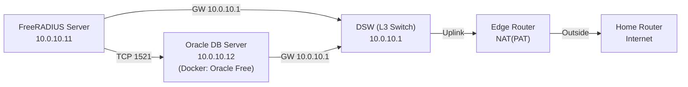

# Docker 기반 Oracle DB 서버 구성 + FreeRADIUS 서버 연결 테스트

> **요약**
> - **DB Server (10.0.10.12)**: Ubuntu + Docker로 **Oracle 23c Free** 컨테이너 기동
> - **FreeRADIUS Server (10.0.10.11)**: Oracle **Instant Client (basic + sqlplus)** 설치 후 DB 접속/연결 테스트
> - **Edge Router**: 내부망(10.0.10.0/28)의 외부 인터넷 통신을 위해 **NAT(PAT)** 설정

---

## 1. Lab 개요

EVE-NG 환경에서 **Oracle DB 서버를 Docker 컨테이너로 구성**하고,  
별도의 **FreeRADIUS 서버에서 Oracle Client(sqlplus)로 접속 가능 여부**를 검증했습니다.

EVE-NG 내부 VM에서 다운로드 속도가 매우 느려 **VMware 네트워크를 Bridged로 전환**했고,  
이 과정에서 상위 공유기가 내부 대역(10.0.10.0/28)을 알지 못해 반환 트래픽이 드롭될 수 있어  
**Edge Router에서 NAT**로 외부 통신을 구성했습니다.

---

## 2. 환경 정보

- DB Server: Ubuntu 24.04.3 LTS (IP: `10.0.10.12/28`)
- FreeRADIUS Server: Ubuntu (IP: `10.0.10.11/28`)
- Default GW(Edge Router): `10.0.10.1`
- Oracle: Docker 이미지 `gvenzl/oracle-free:slim` (Oracle 23c Free)
- Listener Port: `1521/tcp`

---

## 3. 네트워크 토폴로지



---

## 4. DB 서버 네트워크 설정 (netplan)

DB 서버(10.0.10.12)에서 정적 IP/라우팅/DNS를 netplan로 설정했습니다.


예시(`/etc/netplan/01-network-manager-all.yaml`):

```yaml
network:
  version: 2
  renderer: NetworkManager
  ethernets:
    ens3:
      dhcp4: no
      addresses:
        - 10.0.10.12/28
      routes:
        - to: default
          via: 10.0.10.1
      nameservers:
        addresses: [8.8.8.8, 8.8.4.4]
```

적용:

```bash
sudo netplan apply
```

---

## 5. Edge Router NAT 설정 (외부 인터넷 통신)

Bridged 전환 후, 상위 공유기/인터넷에서 내부망(10.0.10.0/28)을 라우팅할 수 없기 때문에  
반환 트래픽이 드롭될 수 있습니다. 이를 해결하기 위해 Edge Router에서 NAT(PAT)를 구성했습니다.


> 아래는 Cisco IOS 스타일 예시입니다. 인터페이스 명칭은 환경에 맞게 변경하세요.

```cisco
! inside
interface g0/0
 ip nat inside

interface g0/1
 ip nat inside

! outside
interface g0/3
 ip nat outside

! default route to home router
ip route 0.0.0.0 0.0.0.0 192.168.45.1

! NAT 대상 내부망(10.0.0.0/16) (172.16.50.0/24)
access-list 10 permit 10.0.0.0 0.0.255.255
access-list 10 permit 172.16.50.0 0.0.0.255
ip nat inside source list 10 interface g0/3 overload
```

---

## 6. Docker 설치 (DB Server)

```bash
sudo apt update
sudo apt install -y ca-certificates curl gnupg lsb-release

sudo mkdir -p /etc/apt/keyrings
curl -fsSL https://download.docker.com/linux/ubuntu/gpg | sudo gpg --dearmor -o /etc/apt/keyrings/docker.gpg

echo "deb [arch=$(dpkg --print-architecture) signed-by=/etc/apt/keyrings/docker.gpg] https://download.docker.com/linux/ubuntu $(lsb_release -cs) stable" | sudo tee /etc/apt/sources.list.d/docker.list > /dev/null

sudo apt update
sudo apt install -y docker-ce docker-ce-cli containerd.io docker-buildx-plugin docker-compose-plugin
```

(선택) sudo 없이 사용:

```bash
sudo usermod -aG docker $USER
# 로그아웃/로그인 또는 재부팅 후 적용
```

---

## 7. Oracle(23c Free) 컨테이너 기동 (DB Server)

### 7.1 이미지/볼륨 확인


```bash
docker volume create oracle-vol
```

### 7.2 컨테이너 실행


```bash
docker run -d \
  --name oracle-free \
  -p 1521:1521 \
  -e ORACLE_PASSWORD='CHANGE_ME_STRONG_PW' \
  -v oracle-vol:/opt/oracle/oradata \
  gvenzl/oracle-free:slim
```

### 7.3 DB Ready 확인


```bash
docker logs -f oracle-free
```

### 7.4 Listener/포트 확인


```bash
ss -lntp | grep 1521
docker port oracle-free
```

---

## 8. FreeRADIUS 서버에서 포트 연결 테스트

FreeRADIUS 서버(10.0.10.11)에서 DB 서버(10.0.10.12)로 `1521/tcp` 연결을 확인했습니다.


```bash
nc -zv 10.0.10.12 1521
# Connection ... succeeded! 확인
```

---

## 9. FreeRADIUS 서버: Oracle Instant Client 설치 (basic + sqlplus)

### 9.1 의존성 설치 (Ubuntu 24.04)


```bash
sudo apt update
sudo apt install -y unzip libaio1t64
```

### 9.2 Instant Client 압축 해제

- `instantclient-basic-linux.x64-*.zip`
- `instantclient-sqlplus-linux.x64-*.zip`

```bash
sudo mkdir -p /opt/oracle
sudo unzip instantclient-basic-linux.x64-*.zip -d /opt/oracle
sudo unzip instantclient-sqlplus-linux.x64-*.zip -d /opt/oracle
```

덮어쓰기 프롬프트가 나오면 **A(All)** 선택:


### 9.3 환경 변수 설정


```bash
sudo nano /etc/profile.d/oracle.sh
```

```bash
export ORACLE_HOME=/opt/oracle/instantclient_23_26
export LD_LIBRARY_PATH=$ORACLE_HOME
export PATH=$ORACLE_HOME:$PATH
```

적용:

```bash
source /etc/profile.d/oracle.sh
```

---

## 10. 트러블슈팅: `libaio.so.1` 미존재로 sqlplus 실행 실패

### 10.1 증상


```bash
sqlplus -v
# error while loading shared libraries: libaio.so.1: cannot open shared object file
```

### 10.2 원인

Ubuntu 24.04에서는 `libaio` 런타임이 `libaio.so.1t64`로 제공되는 경우가 있습니다.  
일부 바이너리(sqlplus)는 과거 SONAME인 `libaio.so.1`을 찾기 때문에 로딩이 실패할 수 있습니다.


### 10.3 해결: 호환 심볼릭 링크 생성 + ldconfig


```bash
sudo ln -s /lib/x86_64-linux-gnu/libaio.so.1t64 /lib/x86_64-linux-gnu/libaio.so.1
sudo ldconfig
sqlplus -v
```

---

## 11. sqlplus로 Oracle 접속 + PDB 컨텍스트 확인

SYS 계정으로 접속 후 `show con_name;`으로 현재 PDB(Service Name)를 확인했습니다.


```bash
sqlplus sys/CHANGE_ME_STRONG_PW@//10.0.10.12:1521/FREEPDB1 as sysdba

SQL> show con_name;
# FREEPDB1 출력 확인
```

---

## 12. (선택) 앱 계정 생성 후 접속 테스트

```sql
CREATE USER radius IDENTIFIED BY cisco123;
GRANT CONNECT, RESOURCE TO radius;
```

```bash
sqlplus radius/cisco123@//10.0.10.12:1521/FREEPDB1
```
## Appendix

- 스크린샷: `assets/screenshots/`
