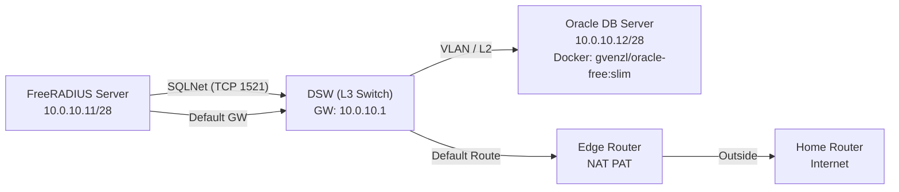

# **목표**  
> Oracle DBMS(employee 역할)에서 사용자 계정 정보를 읽어서, FreeRADIUS가 사용하는 MySQL DBMS(radius)의 **staging 테이블**로 복제한 뒤  
> `radcheck`, `radusergroup`(필요 시 `radreply` 등)에 반영하여 **인증 계정/부서(VLAN) 연동**을 자동화한다.

---

## 1. 환경

### IP/역할
| 구성요소 | 역할 | IP |
|---|---|---|
| FreeRADIUS Server | 계정 동기화 스크립트 실행, MySQL(radius) 보유 | `10.0.10.11/28` |
| Oracle DB Server | Docker로 Oracle Free(slim) 구동 | `10.0.10.12/28` |
| DSW(L3 Switch) | 게이트웨이 / 라우팅 | `10.0.10.1` |
| Edge Router | NAT(PAT)로 외부 통신 | (랩 외부망) |

### Mermaid 다이어그램 (GitHub 호환)


---

## 2. DB 서버(10.0.10.12): Docker Oracle Free(slim) 구성

### 컨테이너 실행
아래 형태로 Oracle Free(slim)을 실행했다.  
- **APP_USER:** `dbadmin`  
- **APP_USER_PASSWORD:** `dbadmin123`

```bash
docker run -d --name account_db \
  -p 1521:1521 \
  -e ORACLE_PASSWORD='cisco123' \
  -e APP_USER='dbadmin' \
  -e APP_USER_PASSWORD='dbadmin123' \
  -v oracle-vol:/opt/oracle/oradata \
  gvenzl/oracle-free:slim
```

📸 스크린샷: 컨테이너 실행  


### Listener 확인 (RADIUS 서버에서)
```bash
nc -zv 10.0.10.12 1521
# succeeded! 이면 OK
```

---

## 3. Oracle 스키마 준비 (v_user_account 뷰)

### 3.1 테이블 생성: `user_account`
Oracle에 사용자 정보를 저장할 **기본 테이블**을 생성.

```sql
CREATE TABLE user_account (
  id        VARCHAR2(20)  NOT NULL,
  emp_name  VARCHAR2(40)  NOT NULL,
  password  VARCHAR2(250) NOT NULL,
  deptcode  VARCHAR2(10)  NOT NULL,
  CONSTRAINT pk_user_account PRIMARY KEY (id)
);
```

📸 스크린샷: 테이블 생성  


### 3.2 뷰 생성: `v_user_account`
`link_account.sh`가 조회할 이름을 `v_user_account`로 맞추기 위해 VIEW를 생성.

```sql
CREATE OR REPLACE VIEW v_user_account AS
SELECT id, emp_name, password, deptcode
FROM user_account;
```

📸 스크린샷: 뷰 생성  


### 3.3 테스트 데이터 INSERT
```sql
INSERT INTO user_account(id, emp_name, password, deptcode) VALUES ('A10010', 'Minsu',  'Minsu123',  '300');
INSERT INTO user_account(id, emp_name, password, deptcode) VALUES ('A10020', 'Songsu', 'Songsu123', '310');
INSERT INTO user_account(id, emp_name, password, deptcode) VALUES ('A10030', 'Yumi',   'Yumi123',   '320');
INSERT INTO user_account(id, emp_name, password, deptcode) VALUES ('A10040', 'Zoro',   'Zoro123',   '330');
INSERT INTO user_account(id, emp_name, password, deptcode) VALUES ('A10050', 'Nami',   'Nami123',   '340');
COMMIT;
```

📸 스크린샷: 샘플 데이터 INSERT  


---

## 4. TroubleShooting: INSERT가 안 됨 (Tablespace quota)

### 증상
- `CREATE TABLE` / `CREATE VIEW`는 되는데 **INSERT가 실패**
- 오류 메시지:  
  `user DBADMIN has insufficient quota on tablespace USERS;`

📸 스크린샷(에러 장면 일부)  


### 원인
- 계정(DBADMIN)이 `USERS` tablespace에 대해 **quota(할당량)가 0**이라 DML(INSERT 등)로 세그먼트 확장이 불가능.

### 해결: SYSDBA로 quota 부여
SYS로 접속 후 DBADMIN에 quota를 부여했다.

```bash
sqlplus sys/cisco123@//10.0.10.12:1521/FREEPDB1 as sysdba
```

```sql
ALTER USER DBADMIN QUOTA UNLIMITED ON USERS;
```

📸 스크린샷: quota 부여  


---

## 5. FreeRADIUS 서버(10.0.10.11): MySQL 스테이징/매핑 테이블

### 5.1 dept → VLAN(groupname) 매핑 테이블: `dept_vlan`
```sql
CREATE TABLE dept_vlan (
  deptcode  VARCHAR(10) NOT NULL,
  groupname VARCHAR(64) NOT NULL,
  deptname  VARCHAR(64) NULL,
  PRIMARY KEY (deptcode)
);
```

예시 데이터:
```sql
INSERT INTO dept_vlan VALUES ('300','VLAN_300','Security Dept');
INSERT INTO dept_vlan VALUES ('310','VLAN_310','Development Dept');
INSERT INTO dept_vlan VALUES ('320','VLAN_320','Business Dept');
INSERT INTO dept_vlan VALUES ('330','VLAN_330','Partner Company');
INSERT INTO dept_vlan VALUES ('340','VLAN_340','Guest Company');
```

📸 스크린샷: `dept_vlan` 확인  


### 5.2 스테이징 테이블: **`temp_empolyee`**
> **중요:** 본 문서에서는 스테이징 테이블명을 최종적으로 `temp_empolyee`로 사용한다.  
> (일부 스크린샷에는 `temp_employee`로 보일 수 있으나, 실제 운영/최종 정리는 `temp_empolyee`로 통일)

권장 스키마(예시):
```sql
CREATE TABLE temp_empolyee (
  emp_id          VARCHAR(20)  NOT NULL,
  emp_name        VARCHAR(40)  NOT NULL,
  password        VARCHAR(250) NOT NULL,
  hashed_password VARCHAR(64)  NOT NULL,
  type            CHAR(1)      NOT NULL,
  deptcode        VARCHAR(10)  NOT NULL,
  groupname       VARCHAR(64)  NULL,
  PRIMARY KEY (emp_id)
);
```

---

## 6. link_account.sh (Oracle → MySQL 복제 자동화)

### 6.1 스크립트 개요
`link_account.sh`는 다음 단계를 수행한다.

1. Oracle `v_user_account`에서 계정 목록 조회 (`CHR(9)`로 TAB 구분)
2. 필요 시 인코딩 변환 (예: `EUC-KR → UTF-8`)
3. 평문 비밀번호를 `smbencrypt`로 해시 생성
4. MySQL에 적용할 SQL(`mysql_apply.sql`)을 생성 후 실행  
   - `DELETE FROM temp_empolyee;`  
   - `INSERT INTO temp_empolyee ...`
5. 마지막으로 `shared.sql`(공통 연동 SQL)을 실행해 실제 반영 (`radcheck`, `radusergroup`)

📸 스크린샷: 헤더/환경변수  


📸 스크린샷: Oracle SELECT 부분  


📸 스크린샷: MySQL INSERT 생성 부분  


### 6.2 Oracle 결과 파일 확인
스크립트 실행 중 생성되는 파일(`/tmp/link_account/oracle_utf8.txt`)을 열어 조회 결과를 확인했다.

📸 스크린샷: oracle_utf8.txt  


---

## 7. shared.sql (실제 계정 연동 로직)

`shared.sql`은 staging 테이블을 기반으로 실제 RADIUS 테이블을 갱신한다.

### 주요 흐름
- `dept_vlan`을 참조해 `groupname` 계산
- 퇴직자 삭제: staging에 없는 username 삭제
- 신규 추가: `radcheck(Cleartext-Password)` / `radusergroup(groupname)` 삽입
- 변경 반영: groupname / password 갱신

📸 스크린샷: shared.sql 전체  


📸 스크린샷: radusergroup UPDATE JOIN  


---

## 8. 결과 검증 (MySQL)

### 8.1 staging(temp_empolyee) 반영 확인
📸 스크린샷 (staging 조회 예시)  


### 8.2 radcheck 반영 확인
📸 스크린샷  


### 8.3 radusergroup 반영 확인
📸 스크린샷  


### 8.2 dept_vlan 
📸 스크린샷


---

## 9 자동화 (cron)

`/etc/crontab`에 등록하여 주기 실행하도록 구성했다.

예시:
```cron
# Account Linking Update SH
1 * * * * root /bin/sh /root/radius/link_account.sh >> /var/log/link_account.log 2>&1
```

📸 스크린샷  


