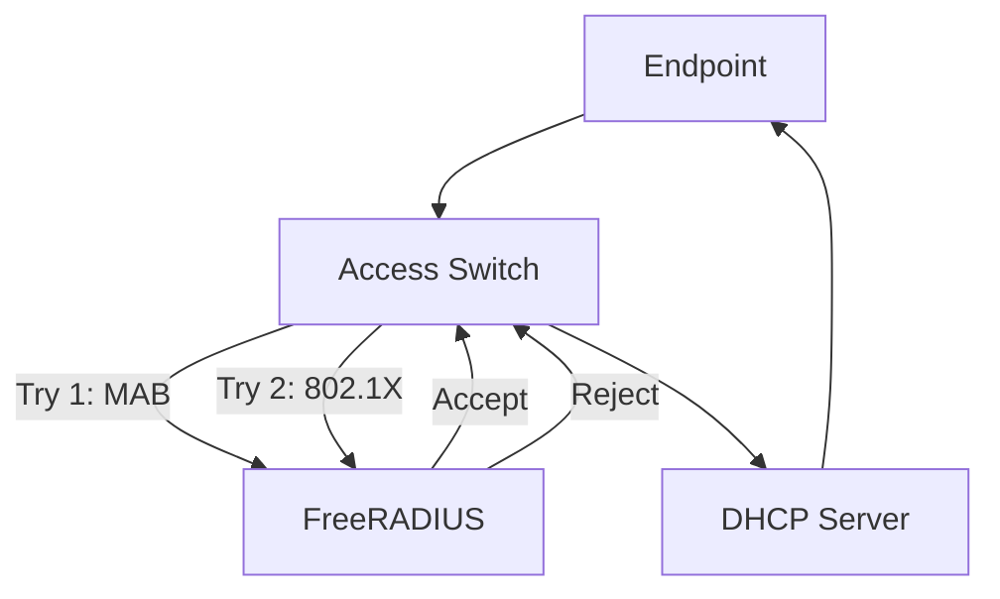

# 단말기 인증 구현 (802.1X + MAB)

> 목표: **802.1X를 지원하는 단말은 1회 사용자 인증(PEAP/EAP 등) 후 MAC 기반(MAB)으로 재인증** 가능하게 만들고,  
> **802.1X 미지원 단말(프린터/IoT 등)은 관리자가 MAC을 등록**하여 MAB로만 인증되도록 구성한다.

---

## 1) 핵심 개념 정리

### 1.1 MAB(MAC Authentication Bypass)란?
- 802.1X(EAP) 인증을 수행할 수 없는 단말을 위해 **스위치가 단말 MAC 주소를 “ID/비밀번호”처럼 사용하여 RADIUS 인증을 시도**하는 방식
- 일반적으로 **username=MAC(구분자 제거, 소문자)**, **password=MAC(동일)** 형태로 RADIUS DB에 저장해 둔다.
- 스위치 포트에서 **MAB → (실패 시) 802.1X** 순서로 시도하게 하면,
  - 이미 등록된 MAC은 MAB로 빠르게 인증
  - 등록되지 않은 단말은 802.1X 사용자 인증으로 fallback

### 1.2 이 실습에서 구현하는 2가지 흐름

## 1.3 인증 흐름 다이어그램(요약)



1) **자동 등록(Auto-Register)**  
   - 802.1X 사용자 인증 성공 로그(Syslog: `Login OK: ... /<via ... cli <MAC>`)를 MySQL(SystemEvents)에 적재  
   - 트리거가 **username + MAC 추출 → MAC을 MAB 계정(radcheck/radusergroup)으로 자동 등록**
2) **수동 등록(Manual-Register)**  
   - 802.1X 미지원 단말은 관리자가 `mab_device` 테이블에 **MAC + 사용자(owner)**만 등록  
   - 트리거가 **VLAN 결정 + IP 풀에서 미사용 IP 할당 + MAB 계정(radcheck/radusergroup) 등록 + 실명제 테이블(endpoint_identity_binding) 등록**

---

## 2) 실습 환경

- DB(Oracle Docker) Server: `10.0.10.12/28` -> 사용자 계정 ( 인사 정보 ) DB
- FreeRADIUS Server: `10.0.10.11/28`
- DB(MySQL) Server: FreeRADIUS DB 포함 (동일 서버 또는 별도) -> 현재는 동일 서버
- DSW(L3 Switch): GW `10.0.10.1`
- Access Switch(Authenticator): 802.1X + MAB 활성화 포트

> **중요**: 아래 SQL은 “현재 사용 중인 테이블명” 기준으로 작성했다.  
> - `vlan_network_profiles` : VLAN/그룹 매핑 테이블  
> - `subnet_ip_pool` : IP 풀 테이블 (미사용=U)  
> - `endpoint_identity_binding` : MAC↔사용자↔VLAN↔IP 바인딩(실명제/추적) 테이블  
> - `radcheck`, `radusergroup` : FreeRADIUS 기본 테이블  
> - `SystemEvents` : rsyslog-mysql 적재 테이블(로그 원본)

---

## 3) 스위치(인증자) 포트 설정: MAB + 802.1X

> 포트마다 설정한다. (인증이 필요한 Access 포트 단위)

```text
conf t
interface g0/0
 switchport mode access

 ! 1) 시도 순서: MAB 먼저 → 실패 시 dot1x
 authentication order mab dot1x

 ! 2) “우선순위”: 동시에 성립할 때 어떤 결과를 우선 적용할지
 authentication priority mab dot1x

 authentication port-control auto
 mab
 dot1x pae authenticator

 spanning-tree portfast
 spanning-tree bpduguard enable
end
write memory
show run interface g0/0
```

### 3.1 order vs priority 차이(요약)
- `authentication order mab dot1x`  
  → **실제로 인증을 “시도”하는 순서**
- `authentication priority mab dot1x`  
  → 둘 다 성립 가능한 상황(재시도/상태머신)에서 **어느 인증 결과를 최종 선택할지 우선순위**

---

## 4) MAB용 데이터 모델(수동 등록 흐름)

### 4.1 mab_device 테이블 생성
관리자가 미지원 단말을 등록하는 “입력 테이블”.

```bash
mysql -u root -p radius <<'SQL'
CREATE TABLE IF NOT EXISTS mab_device (
  mac_addr          VARCHAR(40)  NOT NULL,
  user_name         VARCHAR(40)  NOT NULL DEFAULT '',
  vlan_id           SMALLINT UNSIGNED NOT NULL DEFAULT 0,
  ip_addr           VARCHAR(40)  NOT NULL DEFAULT '',
  ip_number         INT UNSIGNED NOT NULL DEFAULT 0,
  registration_date TIMESTAMP    NOT NULL DEFAULT CURRENT_TIMESTAMP,
  PRIMARY KEY (mac_addr)
) ENGINE=InnoDB DEFAULT CHARSET=utf8mb4;
SQL
```

### 4.2 트리거 1: 신규 등록 시 VLAN/IP 자동 할당 (BEFORE INSERT)

- MAC 정규화: `AA-BB-CC...` → `aa:bb:cc...`
- MAC 형식이 아니면 NULL로 강제(오염 데이터 차단)
- 사용자(owner)의 `radusergroup`을 기반으로 VLAN ID 결정
- 해당 VLAN의 IP 풀에서 미사용(U) IP를 하나 선택하여 ip_number/ip_addr에 채움

```bash
mysql -u root -p radius <<'SQL'
DELIMITER $$

DROP TRIGGER IF EXISTS bi_mab_device $$
CREATE TRIGGER bi_mab_device
BEFORE INSERT ON mab_device
FOR EACH ROW
BEGIN
  -- 1) MAC 정규화(소문자, '-'를 ':'로)
  SET NEW.mac_addr = LOWER(REPLACE(NEW.mac_addr, '-', ':'));

  -- 2) MAC 형식 검증(정확히 17자: xx:xx:xx:xx:xx:xx)
  IF NEW.mac_addr NOT REGEXP '^[0-9a-f:]{17}$' THEN
    SET NEW.mac_addr = NULL;
  END IF;

  -- 3) 사용자(owner)가 속한 그룹(radusergroup) → VLAN ID 매핑
  SET NEW.vlan_id = (
    SELECT a.id
      FROM vlan_network_profiles a
      JOIN radusergroup b ON a.vlan_group_name = b.groupname
     WHERE b.username = NEW.user_name
     LIMIT 1
  );

  -- 4) 미사용 IP 1개 할당 (ip_alloc_state = 'U' & mac/user 비어있는 항목)
  SET NEW.ip_number = (
    SELECT MIN(id)
      FROM subnet_ip_pool
     WHERE vlan_id = NEW.vlan_id
       AND ip_alloc_state = 'U'
       AND mac_addr = ''
       AND user_name = ''
  );

  SET NEW.ip_addr = INET_NTOA(NEW.ip_number);
END $$

DELIMITER ;
SQL
```

### 4.3 트리거 2: 관련 테이블에 실제 등록 수행 (AFTER INSERT)

- `endpoint_identity_binding` : MAC↔사용자↔VLAN↔IP 기록 (reg_type='M')
- `radcheck` : username=mac_plain, password=mac_plain 등록
- `radusergroup` : username=mac_plain, groupname=owner의 groupname 복제
- `subnet_ip_pool` : 해당 IP를 “사용중(A)”으로 마킹 + mac/user 기록

```bash
mysql -u root -p radius <<'SQL'
DELIMITER $$

DROP TRIGGER IF EXISTS ai_mab_device $$
CREATE TRIGGER ai_mab_device
AFTER INSERT ON mab_device
FOR EACH ROW
BEGIN
  DECLARE d_mac_plain VARCHAR(40) DEFAULT '';
  SET d_mac_plain = REPLACE(NEW.mac_addr, ':', '');

  -- 1) endpoint_identity_binding (중복이면 skip)
  IF (SELECT COUNT(*)
        FROM endpoint_identity_binding
       WHERE mac_addr = NEW.mac_addr
         AND vlan_id  = NEW.vlan_id) = 0 THEN
    INSERT INTO endpoint_identity_binding
      (user_name, mac_addr, vlan_id, ip_addr, ip_number, reg_type)
    VALUES
      (NEW.user_name, NEW.mac_addr, NEW.vlan_id, NEW.ip_addr, NEW.ip_number, 'M');
  END IF;

  -- 2) radcheck: MAC 인증 계정(username/password=mac_plain)
  IF (SELECT COUNT(*) FROM radcheck WHERE username = d_mac_plain) = 0 THEN
    INSERT INTO radcheck (username, attribute, op, value)
    VALUES (d_mac_plain, 'Cleartext-Password', ':=', d_mac_plain);
  END IF;

  -- 3) radusergroup: MAC 계정이 owner와 동일한 그룹을 갖도록 복제
  IF (SELECT COUNT(*) FROM radusergroup WHERE username = d_mac_plain) = 0 THEN
    INSERT INTO radusergroup (username, groupname)
    VALUES (
      d_mac_plain,
      (SELECT groupname FROM radusergroup WHERE username = NEW.user_name LIMIT 1)
    );
  END IF;

  -- 4) IP 풀 업데이트(미사용 U → 사용중 A)
  UPDATE subnet_ip_pool
     SET ip_alloc_state = 'A',
         mac_addr = NEW.mac_addr,
         user_name = NEW.user_name
   WHERE id = NEW.ip_number;
END $$

DELIMITER ;
SQL
```

### 4.4 수동 등록 사용법(예시)

```bash
# 802.1X 미지원 단말(프린터 등) MAC + owner만 넣으면 나머지는 트리거가 채움
mysql -u root -p radius -e \
"INSERT INTO mab_device(mac_addr, user_name) VALUES('f0:6b:ca:4e:06:65','55782');"

# 확인
mysql -u root -p radius -e "SELECT * FROM mab_device;"
mysql -u root -p radius -e "SELECT * FROM endpoint_identity_binding WHERE mac_addr='f0:6b:ca:4e:06:65';"
mysql -u root -p radius -e "SELECT * FROM radcheck WHERE username='f06bca4e0665';"
mysql -u root -p radius -e "SELECT * FROM radusergroup WHERE username='f06bca4e0665';"
```

---

## 5) 802.1X 성공 로그 기반 “MAC 자동 등록”(Auto-Register)

### 5.1 ai_systemevents_login_ok_and_dhcp_ack (AFTER INSERT ON SystemEvents)
- 위의 설정되어있던 트리거에 아래 내용을 추가한다.
- **MAC을 MAB 계정(radcheck/radusergroup)으로 자동 등록**한다.
- 사용자 인증 성공 후에는 더 이상 사용자 인증을 하지 않고 MAB을 통해 MAC 인증을 하게 된다.

```bash

  -- 4) MAC → MAB 계정 등록(radcheck)
  IF (SELECT COUNT(*) FROM radcheck WHERE username = d_mac_plain) = 0 THEN
    INSERT INTO radcheck (username, attribute, op, value)
    VALUES (d_mac_plain, 'Cleartext-Password', ':=', d_mac_plain);
  END IF;

  -- 5) MAC → 사용자와 동일 그룹(radusergroup 복제)
  IF (SELECT COUNT(*) FROM radusergroup WHERE username = d_mac_plain) = 0 THEN
    INSERT INTO radusergroup (username, groupname)
    VALUES (
      d_mac_plain,
      (SELECT groupname FROM radusergroup WHERE username = d_user_name LIMIT 1)
    );
  END IF;

```

---

## 6) 비인증(802.1X 미지원) 단말 `mab_device` 테이블에 수정/삭제 작업 

### 6.1 동작 시나리오(왜 트리거가 필요한가)

- `mab_device`는 관리자가 직접 수정할 수 있다.  
- 하지만 다음 항목들은 “자동 관리 영역”이기 때문에 사람이 임의로 바꾸면 데이터가 틀어진다.

- `vlan_id`, `ip_addr`, `ip_number`  
  → 사용자 정책/풀 상태에 의해 자동 계산되어야 함
- `user_name` 변경  
  → 사용자 변경은 VLAN 정책 변경으로 이어질 수 있고, 그 결과 IP 재할당까지 발생할 수 있음
- `mac_addr` 변경  
  → MAC 인증 계정(`radcheck`, `radusergroup`)과 바인딩 테이블 모두 동기화 필요
- 행 삭제  
  → IP 반납 + MAC 인증 계정 삭제 + 바인딩 테이블 삭제 필요

  
### 6.2  `bu_mab_device` (BEFORE UPDATE)

**목적**
1) 자동으로 관리되는 컬럼(`vlan_id`, `ip_addr`, `ip_number`)을 사람이 임의로 바꾸는 것을 차단  
2) `user_name`이 바뀌면, 그 사용자에 맞는 VLAN을 재계산하고(= 정책 반영)  
   VLAN이 바뀌는 경우, 신규 VLAN에서 사용 가능한 IP를 1개 할당한다.

**핵심 동작**
- `new.vlan_id`가 변경 시도되면 `old.vlan_id`로 되돌림
- `new.ip_addr`/`new.ip_number` 변경 시도되면 `old` 값으로 되돌림
- `user_name`이 변경되면:
  - `radusergroup`과 `vlan_network_profiles`를 통해 새 VLAN ID 계산
  - VLAN이 바뀌었으면 `subnet_ip_pool`에서 빈 IP(min(id)) 할당 + `ip_addr` 갱신

```bash
DELIMITER $$

DROP TRIGGER IF EXISTS bu_mab_device $$
CREATE TRIGGER bu_mab_device
BEFORE UPDATE ON mab_device
FOR EACH ROW
BEGIN
  DECLARE d_vlan_id INT DEFAULT 0;

  -- 자동으로 등록되는 컬럼 값 변경 금지
  IF new.vlan_id <> old.vlan_id THEN
    SET new.vlan_id = old.vlan_id;
  END IF;

  IF (new.ip_addr <> old.ip_addr) OR (new.ip_number <> old.ip_number) THEN
    SET new.ip_addr = old.ip_addr;
    SET new.ip_number = old.ip_number;
  END IF;

  -- 단말기 사용자 변경(소유자 변경)에 따른 정보 변경
  IF new.user_name <> old.user_name THEN

    -- 변경된 사용자에 따라 VLAN ID 변경
    -- (원본: FROM vlan_network_profiles a, radusergroup b ... 형태)
    SET new.vlan_id = (
      SELECT a.id
      FROM vlan_network_profiles a
      JOIN radusergroup b ON a.vlan_group_name = b.groupname
      WHERE b.username = new.user_name
      LIMIT 1
    );

    -- VLAN ID가 변경되었다면, 해당 VLAN에 해당하는 IP 주소 할당
    IF new.vlan_id <> old.vlan_id THEN
      SET new.ip_number = (
        SELECT MIN(id)
        FROM subnet_ip_pool
        WHERE vlan_id = new.vlan_id
          AND ip_alloc_state = 'U'
          AND mac_addr = ''
          AND user_name = ''
      );

      SET new.ip_addr = INET_NTOA(new.ip_number);
    END IF;
  END IF;
END$$

DELIMITER ;
```


### 6.3  `au_mab_device` (AFTER UPDATE)

**목적**
`mab_device`의 변경 내용을 연관 테이블로 반영한다.

**키 포인트**
- MAC 계정은 `radcheck.username`, `radusergroup.username`에 **콜론 제거한 plain MAC**을 사용한다.
  - 예: `f0:6b:ca:4e:06:65` → `f06bca4e0665`

**분기별 동작**
1) **user_name 변경**
   - `subnet_ip_pool`의 사용자 정보 갱신
   - `endpoint_identify_binding`의 사용자 정보 갱신

2) **vlan_id 변경(= IP 재할당 포함)**
   - 기존 IP 반납(풀에서 mac/username 비우기)
   - 신규 IP에 mac_addr/user_name 기록
   - `endpoint_identify_binding`의 VLAN/IP 정보 갱신
   - MAC 계정의 `radusergroup.groupname`을 새 사용자 그룹으로 동기화

3) **mac_addr 변경**
   - `subnet_ip_pool`, `endpoint_identify_binding`의 mac_addr 갱신
   - `radcheck`의 username/value를 new plain mac으로 갱신
   - `radusergroup`의 username을 new plain mac으로 갱신

```bash
DELIMITER $$

DROP TRIGGER IF EXISTS au_mab_device $$
CREATE TRIGGER au_mab_device
AFTER UPDATE ON mab_device
FOR EACH ROW
BEGIN
  DECLARE d_mac_plain_old VARCHAR(20) DEFAULT '';
  DECLARE d_mac_plain_new VARCHAR(20) DEFAULT '';

  SET d_mac_plain_old = REPLACE(old.mac_addr, ':', '');
  SET d_mac_plain_new = REPLACE(new.mac_addr, ':', '');

  -- 사용자 변경에 따른 해당 작업 수행
  IF new.user_name <> old.user_name THEN

    -- subnet_ip_pool 테이블의 사용자정보 변경
    UPDATE subnet_ip_pool
       SET user_name = new.user_name
     WHERE ip_number = old.ip_number;

    -- endpoint_identify_binding 테이블 정보 변경
    UPDATE `radius`.`endpoint_identify_binding`
       SET user_name = new.user_name
     WHERE mac_addr = old.mac_addr;
  END IF;

  -- VLAN ID 변경여부 확인 후 해당 작업 수행
  IF new.vlan_id <> old.vlan_id THEN

    -- 이전에 할당했던 IP 주소 할당 해제
    UPDATE subnet_ip_pool
       SET mac_addr = '',
           user_name = ''
     WHERE ip_number = old.ip_number;

    -- 신규로 할당된 IP 주소에 사용자정보 기록
    UPDATE `radius`.`subnet_ip_pool`
       SET mac_addr = new.mac_addr,
           user_name = new.user_name
     WHERE ip_number = new.ip_number;

    -- endpoint_identify_binding 테이블 정보 변경
    UPDATE `radius`.`endpoint_identify_binding`
       SET user_name = new.user_name,
           vlan_id  = new.vlan_id,
           ip_addr   = new.ip_addr,
           ip_number   = new.ip_number
     WHERE mac_addr = old.mac_addr;

    -- RADUSERGROUP 테이블 변경
    UPDATE `radius`.`radusergroup`
       SET groupname = (
         SELECT groupname
           FROM `radius`.`radusergroup`
          WHERE username = new.user_name
          LIMIT 1
       )
     WHERE username = d_mac_plain_old;
  END IF;

  -- 단말기 맥 주소 변경 여부 확인 후 해당 작업 수행
  IF new.mac_addr <> old.mac_addr THEN

    -- subnet_ip_pool의 단말기정보 변경
    UPDATE `radius`.`subnet_ip_pool`
       SET mac_addr = new.mac_addr
     WHERE mac_addr = old.mac_addr;

    -- endpoint_identify_binding 테이블 정보 변경
    UPDATE `radius`.`endpoint_identify_binding`
       SET mac_addr = new.mac_addr
     WHERE mac_addr = old.mac_addr;

    -- RADCHECK 테이블 정보 변경
    UPDATE `radius`.`radcheck`
       SET username = d_mac_plain_new,
           value    = d_mac_plain_new
     WHERE username = d_mac_plain_old;

    -- RADUSERGROUP 테이블 정보 변경
    UPDATE `radius`.`radusergroup`
       SET username = d_mac_plain_new
     WHERE username = d_mac_plain_old;
  END IF;
END$$

DELIMITER ;
```

### 6.4  `ad_mab_device` (AFTER DELETE)

**목적**
`mab_device`에서 단말을 삭제하면 관련 정보를 “정리(clean up)” 한다.

**동작**
- `subnet_ip_pool`에서 해당 단말이 쓰던 IP를 반납(사용자/맥주소 공백 처리)
- MAC 계정(`radcheck`, `radusergroup`) 삭제
- 바인딩(`endpoint_identify_binding`) 삭제

```bash
DELIMITER $$

DROP TRIGGER IF EXISTS ad_mab_device $$
CREATE TRIGGER ad_mab_device
AFTER DELETE ON mab_device
FOR EACH ROW
BEGIN
  DECLARE d_mac_plain VARCHAR(45) DEFAULT '';

  SET d_mac_plain = REPLACE(old_mac_addr, ':', '');

  -- IP Pool 반납
  UPDATE subnet_ip_pool
     SET user_name = '',
         mac_addr  = ''
   WHERE ip_number = old.ip_number;

  -- MAC 계정 삭제
  DELETE FROM radcheck     WHERE username = d_mac_plain;
  DELETE FROM radusergroup WHERE username = d_mac_plain;

  -- 바인딩 삭제
  DELETE FROM endpoint_identify_binding WHERE mac_addr = old_mac_addr;
END$$

DELIMITER ;
```
